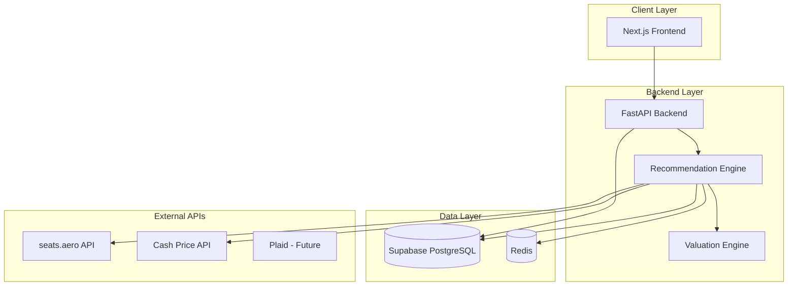
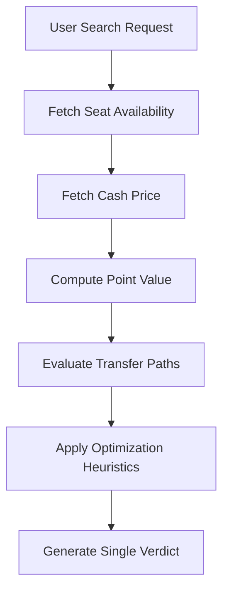
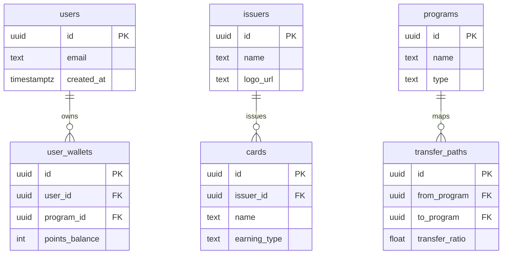

# MyTravelWallet

**AI-Powered Travel Rewards Optimization Engine**

MyTravelWallet is a deterministic decision engine that evaluates whether a user should pay cash or redeem points for a flight — and identifies the optimal loyalty program and transfer path.

Unlike conversational AI systems, MyTravelWallet is built as a financial optimization system focused on explainability, valuation accuracy, and portfolio efficiency.


## Architecture Overview

**Stack**

* Frontend: Next.js
* Backend: FastAPI
* Database: Supabase (PostgreSQL)
* Cache: Redis
* External APIs: seats.aero, Cash Pricing API
* Deployment: Vercel (frontend), Railway/Render (backend)


## High-Level System Architecture




## Core Principles

### 1. Deterministic Verdict System

* One clear recommendation
* No ambiguity
* Fully explainable decision logic

### 2. Program-Normalized Data Model

* Unified schema across issuers and programs
* Transferable programs separated from airline/hotel programs

### 3. Multi-Layer Optimization Pipeline

* Availability validation
* Cash price comparison
* Transfer path modeling
* Effective point valuation
* Heuristic optimization

### 4. ML-Ready Architecture

* Seat availability prediction (future)
* Dynamic valuation modeling (future)
* Transfer success probability modeling (future)

# Backend — FastAPI

## Entry Point

`main.py` initializes:

* Wallet routes
* Search routes
* Recommendation routes
* Admin routes
* Health endpoints


## Core Modules

| Module           | Responsibility                  |
| ---------------- | ------------------------------- |
| wallet/          | User portfolio management       |
| search/          | Flight search orchestration     |
| recommendation/  | Core decision logic             |
| valuation/       | Point valuation engine          |
| transfer_engine/ | Transfer partner graph modeling |
| availability/    | seats.aero integration          |
| pricing/         | Cash price API integration      |
| cache/           | Redis caching                   |
| models/          | Pydantic schemas                |
| database/        | Supabase ORM layer              |

# Recommendation Engine

The Recommendation Engine evaluates multiple redemption strategies and produces a single verdict.

---

## Decision Pipeline



## Core Valuation Logic

### Basic Formula

```
Point Value = Cash Price / Points Required
```

### Enhanced Formula

```
Effective Value = (Cash Price - Taxes) / (Points + Transfer Cost)
```


## Optimization Rules

* Reject options below user-defined threshold (e.g., 1.2 cpp)
* Penalize multi-hop transfer chains
* Penalize low availability confidence
* Reward direct transfer partners
* Factor in transfer ratios
* Consider taxes and fees


## Transfer Graph Modeling

Programs are modeled as a directed graph:

```
Chase → United
Amex → Air Canada
Capital One → British Airways
```

Supports:

* Direct transfer
* Multi-hop transfer
* Transfer bonuses (future)
* Transfer timing constraints


# Database Schema

## Core Entity Model




# Frontend — Next.js

## Route Map

| Route             | Purpose         |
| ----------------- | --------------- |
| `/`               | Landing page    |
| `/search`         | Flight search   |
| `/wallet`         | Manage wallet   |
| `/recommendation` | Verdict display |
| `/profile`        | Settings        |

---

## Core UI Components

| Component         | Purpose                      |
| ----------------- | ---------------------------- |
| SearchWizard      | Multi-step search            |
| WalletManager     | Manage programs and balances |
| VerdictCard       | Final recommendation display |
| TransferBreakdown | Shows transfer path          |
| ValueMeter        | CPP visualization            |


# EPIC Roadmap

## EPIC-0: Canonical Data Model

* issuers
* programs
* transfer_paths
* cards

## EPIC-1: API Integration

* Wallet API
* Search API
* Basic verdict output

## EPIC-2: Optimization Engine

* Full transfer graph
* Valuation heuristics
* Confidence scoring

## EPIC-3: ML Layer (Future)

* Seat availability prediction
* Dynamic point valuation
* User preference learning


# Deployment

| Layer      | Platform             |
| ---------- | -------------------- |
| Frontend   | Vercel               |
| Backend    | Railway / Render     |
| Database   | Supabase             |
| Cache      | Redis                |
| Monitoring | Sentry               |
| Domain     | mytravelwallet.ai    |


# Environment Variables

## Backend

* `SUPABASE_URL`
* `SUPABASE_SERVICE_ROLE_KEY`
* `SEATS_AERO_API_KEY`
* `CASH_PRICE_API_KEY`
* `REDIS_URL`

## Frontend

* `NEXT_PUBLIC_API_URL`
* `NEXT_PUBLIC_SUPABASE_URL`
* `NEXT_PUBLIC_SUPABASE_ANON_KEY`


MyTravelWallet is a deterministic optimization engine focused on:

* Portfolio efficiency
* Valuation accuracy
* Explainable decision logic
